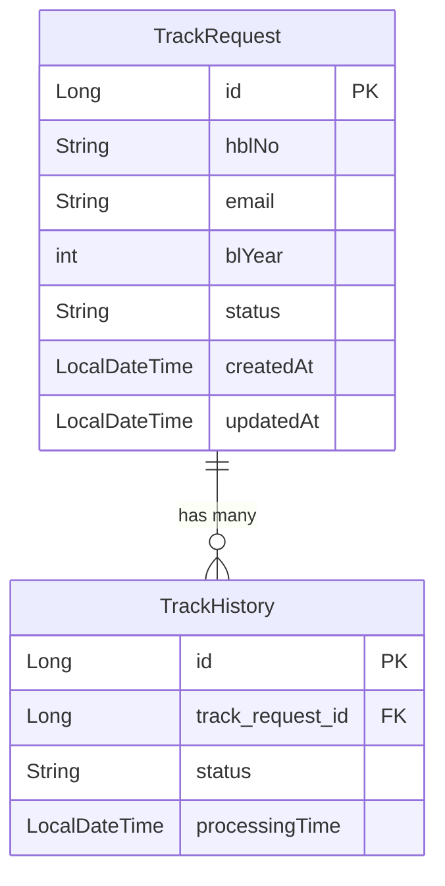

```mermaid
erDiagram
    TrackRequest ||--o{ TrackHistory : "has many"
    TrackRequest {
        Long id PK
        String hblNo
        String email
        int blYear
        String status
        LocalDateTime createdAt
        LocalDateTime updatedAt
    }
    TrackHistory {
        Long id PK
        Long track_request_id FK
        String status
        LocalDateTime processingTime
    }
```