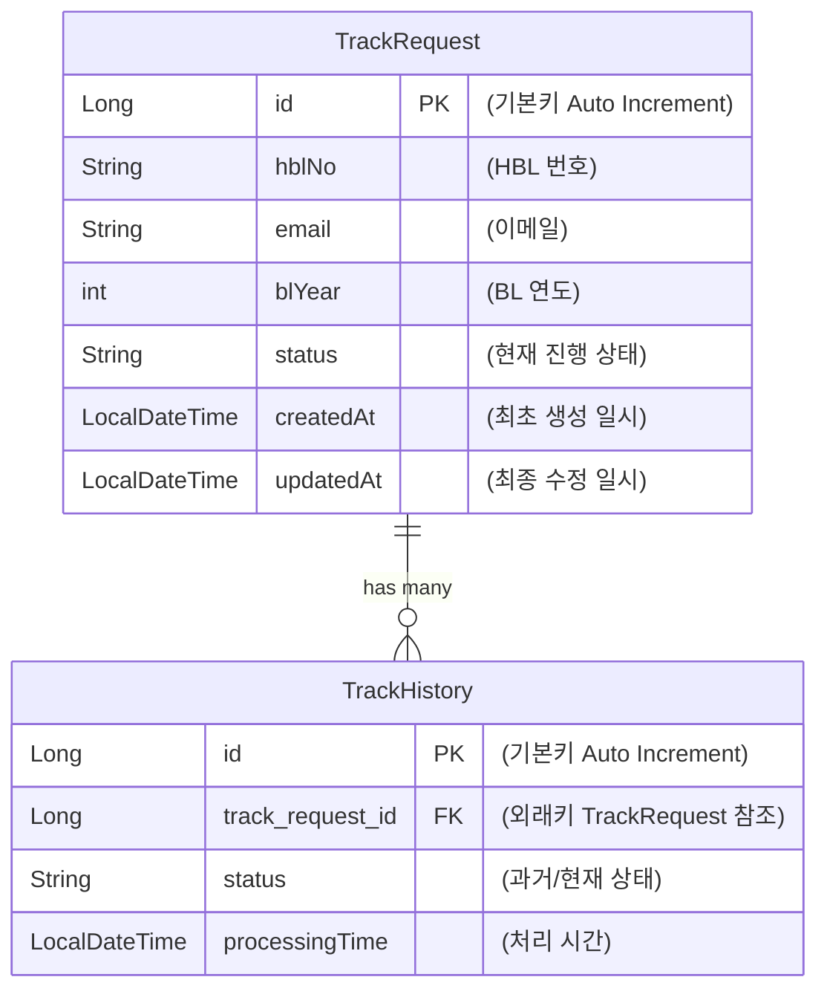

# ChaseC
> A comprehensive cargo tracking system.

## 프로젝트 개요
ChaseC는 통관 과정 조회 시스템으로, 사용자가 화물의 통관 상태를 실시간으로 확인할 수 있도록 도와줍니다. 이 시스템은 관세청 API와 연동하여 최신 통관 정보를 제공합니다.
그리고 사용자는 이메일을 통해 통관 상태 업데이트를 받을 수 있습니다.

## 주요 기능
- **화물 통관 상태 조회**: 사용자는 HBL(운송장)를 입력하여 화물의 통관 상태를 조회할 수 있습니다.
- **이메일 알림**: Spring Scheduler를 통해 주기적으로 상태 변동을 감지하고, 변동시 이메일을 발송하여 상태변화를 고객에게 알려줄 수 있습니다.
- **이력 관리**: 모든 통관 상태 변경 이력을 데이터베이스에 저장하여, 사용자가 이전 상태를 조회할 수 있도록 지원합니다.

## 기술 스택
- **Backend**: Spring Boot
- **Frontend**: Thymeleaf, JavaScript, BootStrap 5.3.8
- **데이터베이스**: MySQL
- **API**: 관세청 오픈 API
- **이메일 서비스**: JavaMailSender
- **빌드 도구**: Gradle
- **형상 관리**: Git

## 프로젝트 구조
```plaintext
chasec/
├── src/main/
│   ├── java/com/example/chasec/
│   │   ├── controller/        # REST API 컨트롤러
│   │   ├── service/           # 비즈니스 로직
│   │   ├── repository/        # 데이터베이스 접근 레이어
│   │   ├── entity/            # JPA 엔티티 클래스
│   │   ├── dto/               # 데이터 전송 객체
│   │   └── ChasecApplication.java  # 메인 애플리케이션 클래스
│   └── resources/
│       ├── application.properties  # 애플리케이션 설정 파일
│       └── templates/              # 이메일 템플릿
└── build.gradle                  # Gradle 빌드 스크립트
```   

## ERD


## 데이터 흐름
```graph LR
    A[사용자] -->|1. 조회 요청| B[Controller]
    B -->|2. 로직 수행| C[Service]
    C -->|3. API 호출| D[관세청 API]
    D -->|4. XML 응답| C
    C -->|5. 파싱 & DB 저장| E[MySQL]
    E -->|6. 상태 변경 감지| F[Scheduler]
    F -->|7. 메일 발송| G[Email Service]
    G -->|8. 알림 도착| A
``` 