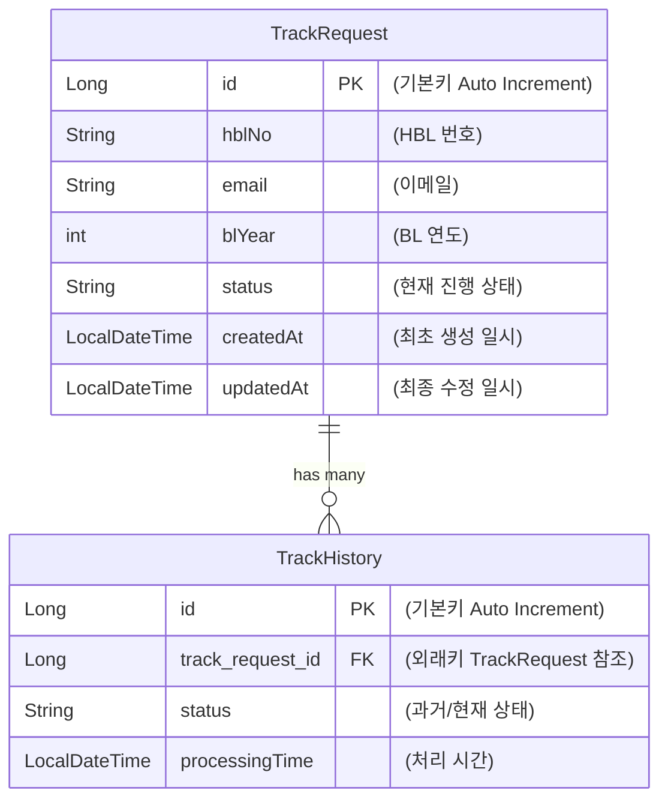
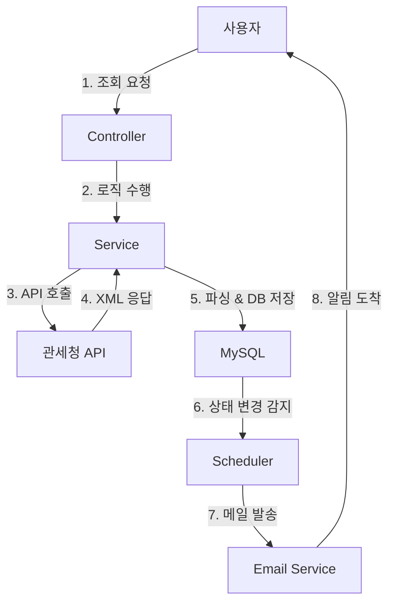

# ChaseC
> 통관 추적 시스템

## 프로젝트 개요 (Project Overview)
ChaseC는 통관 과정 조회 시스템으로, 사용자가 화물의 통관 상태를 실시간으로 확인할 수 있도록 도와줍니다. 이 시스템은 관세청 API와 연동하여 최신 통관 정보를 제공합니다.
그리고 사용자는 이메일을 통해 통관 상태 업데이트를 받을 수 있습니다.

## 주요 기능 (Key Features)
- **화물 통관 상태 조회**: 사용자는 HBL(운송장)를 입력하여 화물의 통관 상태를 조회할 수 있습니다.
- **이메일 알림**: Spring Scheduler를 통해 주기적으로 상태 변동을 감지하고, 변동시 이메일을 발송하여 상태변화를 고객에게 알려줄 수 있습니다.
- **이력 관리**: 모든 통관 상태 변경 이력을 데이터베이스에 저장하여, 사용자가 이전 상태를 조회할 수 있도록 지원합니다.
-----
## 기술 스택 (Tech Stack)
- **Backend**: Java 17, Spring Boot 3.5.10, Spring Data JPA, Spring Scheduler
- **Frontend**: Thymeleaf, JavaScript(ES6), BootStrap 5.3.8
- **데이터베이스**: MySQL 8.4
- **API**: 관세청 오픈 API
- **이메일 서비스**: JavaMailSender
- **빌드 도구**: Gradle - Groovy
- **형상 관리**: Git
-----
## 프로젝트 구조 (Project Structure)
```plaintext
chasec/
├── src/main/
│   ├── java/com/example/chasec/
│   │   ├── controller/        # REST API 컨트롤러
│   │   ├── service/           # 비즈니스 로직
│   │   ├── repository/        # 데이터베이스 접근 레이어
│   │   ├── entity/            # JPA 엔티티 클래스
│   │   ├── dto/               # 데이터 전송 객체
|   |   ├── exception/         # 컨트롤러 전역 예외 처리
│   │   └── ChasecApplication.java  # 메인 애플리케이션 클래스
│   └── resources/
│       ├── application.properties  # 애플리케이션 설정 파일
│       └── templates/              # 이메일 템플릿
└── build.gradle                  # Gradle 빌드 스크립트
```   

## ERD


## 데이터 흐름

-----
## Troubleshooting
1. 관세청 API XML 변환 및 파싱 문제
 - **문제**: 관세청 API의 반환형식이 XML로 되어있어 JSON 변환이 필요했으며, JSON 변환 과정에서 타입 캐스팅 애러
 - **해결책**: org.json라이브러리를 사용하여 XML을 JSON으로 변환 후 파싱.

2. 스케줄러 중단
 - **문제**: updateStatus 스케줄러 로직 내에서 특정 화물이 '통관완료' 상태일 때 break를 사용하여 반복문을 탈출해버림. 이로 인해 뒤에 있는 대기열의 화물들이 업데이트되지 않음.
 - **해결책**: break를 continue로 변경하여 해당 화물만 건너뛰고 다음 화물들에 대한 업데이트가 계속 이루어지도록 수정.

3. API키 관리
  - **문제**: 이전 프로젝트에서 application.properties파일을 git에 올리지 않고 각자 관리하여 api키가 누락되는 문제가 발생.
  - **해결책**: application-secret.properties파일을 별도로 만들어 .gitignore에 등록함.spring.profiles.include를 사용하여 application.properties에서 참조하도록 설정.

4. JPA 양방향 연관관계 데이터 동기화
 - **문제**: 새로운 통관 이력(TrackHistory)을 DB에 save() 했음에도 불구하고, 부모 객체(TrackRequest)를 조회하여 반환할 때 방금 저장한 최신 이력이 리스트에 포함되지 않는 문제 발생. 이를 해결하기 위해 DB를 다시 조회하는 비효율적인 쿼리가 발생함.
 - **해결책**: DB 저장과 동시에 부모 객체의 컬렉션(List)에도 해당 객체를 수동으로 add() 해주는 로직을 추가. 이를 통해 추가적인 DB 조회 없이 데이터 정합성을 맞추고 성능을 최적화함.